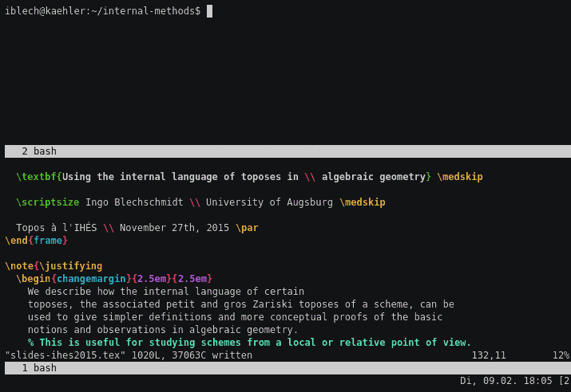

# sshlatex: A collection of hacks to efficiently run LaTeX via ssh

Tired of long LaTeX compile times on your old, slow computer? Do you want a
tool which monitors your source file for changes, copies it to a fast remote
server, runs LaTeX there, and downloads the resulting PDF file?

Then look no further. Actually, you should; this repository is a collection of
horrible hacks to make this possible. They work for me. Highlights are that
sshlatex prestarts LaTeX on the server with the previous run's preamble to
preload all those required LaTeX packages and that it starts streaming the PDF
file before LaTeX finishes creating it.

## Usage

1. Run `sshlatex ssh.example.org foo.tex` in the background. Just as with
   `pdflatex`, you may drop the `.tex` if you want to.
2. Work on your file `foo.tex`.
3. Enjoy an updated PDF each time you save your changes.

Optionally, put a program `beepy` in your `$PATH` (or change the corresponding
line in the source code) to audibly inform you of a completed run. Useful for
when you're switching virtual desktops and don't see the output of sshlatex.

See below for when you don't have passphrase-less login to the remote end set up.

Tip for when you're using a lightweight PDF viewer which doesn't auto-reload on
changes: Put something like the following in your `beepy` program.

    # Send the "r" key to all running mupdf instances.
    for i in `xdotool search --class mupdf`; do
        xdotool key --window $i r
    done

## Features

* No installation is necessary, neither on the remote host nor on the local side.
* Images and sources included with `\includegraphics`, `\input`, and `\include`
  are automatically copied to the compile server. Accompanying `.bbl`
  files are as well.
* Even before the source file is changed, LaTeX gets already started on the
  remote host with the preamble of the previous run. This way all the required
  packages are already loaded when the new version is ready to be compiled,
  shaving off a couple of hundreds of milliseconds.
* Downloading the resulting PDF file starts before each run of `pdflatex`
  has finished. Since `pdflatex` does not simply append to the output file, but
  seeks and overwrites earlier parts, sshlatex is prepared to transfer some
  blocks multiple times if necessary. This is still faster than waiting for
  `pdflatex` to finish and then doing a proper `rsync`.
* Temporary files on the server are properly cleaned up on `^C`.
* Filenames with special characters in them are supported.

## Dependencies

Aside from standard Linux tools and Perl 5 (included in the base installation of
practically any Linux distribution), sshlatex has no dependencies on the local
host and only LaTeX on the remote host. If inotifywait from the inotify-tools
package is installed on the local side, sshlatex will use it instead of
resorting to polling for detecting changes in the source files.

You should use the multiplexing capabilities of ssh, so that new connections
are piggybacked over an already established connection avoiding the
time-consuming TCP and cryptography handshake. Add the following two lines to
your local `~/.ssh/config` and open a separate SSH connection before you start
sshlatex.

    ControlMaster auto
    ControlPath ~/.ssh/control:%h:%p:%r

_If you don't have passphrase-less login to the remote end set up, ssh multiplexing is
not only nice to have, but absolutely crucial, as else you'd be forced to enter
login credentials each time you change the LaTeX source._

## Purely local usage

Because of the prestart feature, sshlatex can even make sense if you run it
purely locally. Call `sshlatex localhost foo.tex`.

## Security considerations

Essentially, don't run sshlatex on untrusted files or with untrusted servers.
Specifically:

* sshlatex places several files, including LaTeX source files, in a temporary
  directory on the server side. This might leak data or metadata (for instance
  on when you are working on your LaTeX documents) to the administrator or
  other users on the server. You can change the location
  of the temporary directory by arranging an appropriate value of `$TMPDIR` on
  the remote end.
* sshlatex happily uploads any included files to the server, even files
  outside the base directory (as for instance prompted by a command like
  `\includegraphics{/etc/passwd}` in the LaTeX source file).
* When downloading the resulting PDF file, sshlatex accepts any data from the
  server. This could be exploited by an attacker for a denial of service
  attack by filling the memory or disk.

## Shortcomings

* Written in haste, will contain bugs. Is a grave assortment of hacks, the
  least of which is using the `LC_*` environment variables to pass data to the
  remote host.
* Not customizable.
* Doesn't support fancy reruns of LaTeX for making sure that references are
  correct and so on. This tool is for rapidly iterating.

## License

sshlatex is dual-licensed, meaning that you can (and are invited to) use,
redistribute and modify it under the terms of either:

1. The GNU General Public License (GPL), version 3 or (at your option) any
   later version published by the Free Software Foundation.
2. The LaTeX Project Public License (LPPL), version 1.3c or (at your option)
   any later version.
